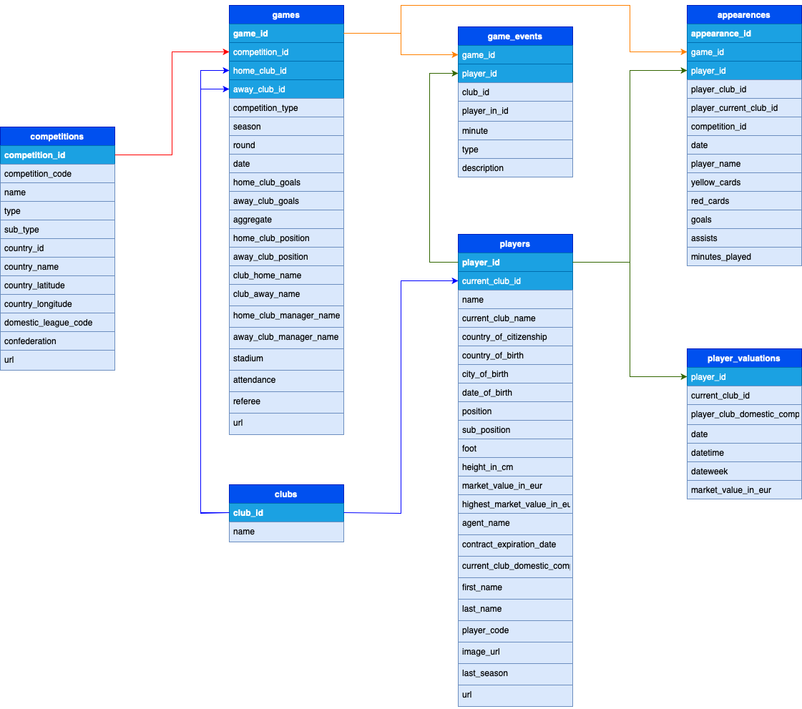

# Data Managment of a football dataset

 

  
  
  

  

  

This Repository refers to the Homeworks of the course Data Management (DM) at University Sapienza of Rome 2022/2023.

# Abstract
The [dataset](https://www.kaggle.com/datasets/davidcariboo/player-scores) is composed of multiple CSV files with information on competitions, games, clubs, players and appearances that is automatically updated once a week. It includes:

- 60.000+ games from many seasons on all major competitions
- 400+ clubs from those competitions
- 28.000+ players from those clubs
- 300.000+ player market valuations historical records
- 1.000.000+ player appearance records from all games

 

  
  
  

  

   Figure 1: Schema
  

## Group members:
* [Andrea Protani](https://github.com/Prot10)
* [Alessandro Sottile](https://github.com/Sottix99)
