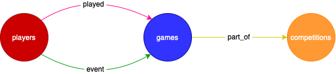

# Data Managment of a football dataset

 

  
  
  

  

  

This Repository refers to the Homeworks of the course Data Management (DM) at University Sapienza of Rome 2022/2023.

## Abstract
Condensed in this repo are the 3 homeworks done during the course. 
In the first one, the goal was to build a football data management system and test its operation by querying it with 10 queries.  In the second homework, the goal was to try to optimize the previously created schema and do the same with 4 queries chosen from the previous 10. In the last homework, on the other hand, the goal was to recreate the same schema, in NOSQL version on NEo4j.  
 

## Dataset
The [dataset](https://www.kaggle.com/datasets/davidcariboo/player-scores) is composed of multiple CSV files with information on competitions, games, clubs, players and appearances that is automatically updated once a week. It includes:

- 60.000+ games from many seasons on all major competitions
- 400+ clubs from those competitions
- 28.000+ players from those clubs
- 300.000+ player market valuations historical records
- 1.000.000+ player appearance records from all games

The structure of the original dataset was modified. First, pre-processing operations regarding changing the type of the various columns were applied. In addition, some tables were deleted or merged together with others to arrive at a more correct and useful schema for the purposes of the homework.

 

  
  
  

  

   Figure 1: Schema for HW1 and HW2
  

 

  
  
  

  

   Figure 2: Structure of NOSQL dataset (HW3)
  

## Group members:
* [Andrea Protani](https://github.com/Prot10)
* [Alessandro Sottile](https://github.com/Sottix99)
